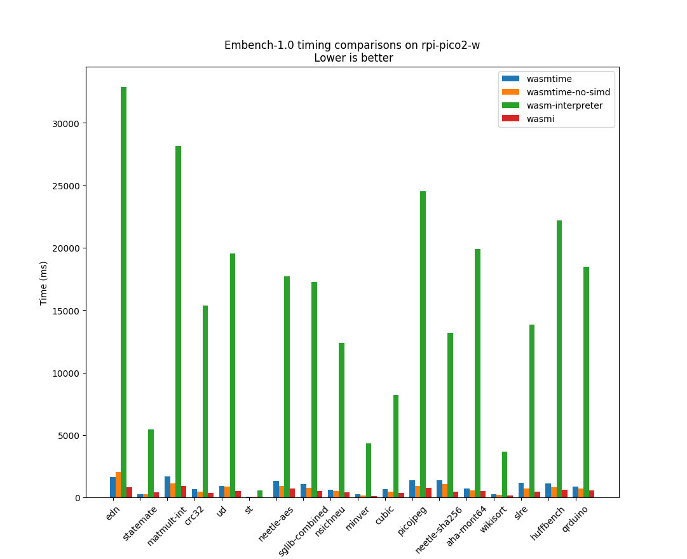

# Comparing WebAssembly Runtimes of Ariel OS

This repository aims to help in reproducibly benchmarking WebAssembly runtimes in the context of Ariel OS both in terms of code size and performance.

## Comparing Sizes

### Protocol
To compare the size of the resulting binary from each runtime, they will all be evaluted using a minimal capsule. Below is the code of the aforementioned capsule.
```rust
#![no_std]

#[link(wasm_import_module = "host")]
unsafe extern "C" {
    fn extra() -> u32;
}


#[unsafe(no_mangle)]
extern "C" fn add_with_extra(a: u32, b: u32) -> u32 {
    a + b + unsafe { extra() }
}

#[panic_handler]
fn panic_handler(_: &core::panic::PanicInfo<'_>) -> ! {
    core::arch::wasm32::unreachable();
}
```

It will be compiled for the `wasm32v1-none` target using the following `.cargo/config.toml` for maximal binary size optimizations.

```toml
[unstable]
build-std = ["core", "alloc", "panic_abort"]
build-std-features = ["optimize_for_size", "panic_immediate_abort"]

[build]
rustflags = [
    "-Z", "location-detail=none",
    "-C", "link-arg=--initial-memory=65356",
    "-C", "link-arg=-zstack-size=4096"
]
target = "wasm32v1-none"

[profile.release]
opt-level= "z"
codegen-units = 1
lto = "fat"
debug = false
strip = "symbols"
```

For wasmtime, since it doesn't support raw wasm bytecode in `#![no_std]` contexts, an extra step of precompilation is needed. The following configuration is used for that step

```rust
use wasmtime::{Config, Engine, OptLevel};

fn main() -> wasmtime::Result<()> {
    let mut config = Config::new();

    // Options that were found to reduce code size
    config.memory_init_cow(false);
    config.generate_address_map(false);
    config.table_lazy_init(false);
    config.cranelift_opt_level(OptLevel::Speed);

    // 0 means limiting ourselves to what the module asked
    // This needs to be set at pre-compile time to use it at runtime
    config.memory_reservation(0);

    // Disabling this allows runtime optimizations but means that the maximum memory
    // that the module can have is
    // S = min(initial_memory, memory_reservation) + memory_reserver_for_growth
    // since it can grow by reallocating.
    config.memory_may_move(false);

    // Explictly disabling the component model
    config.wasm_component_model(false);

    let engine = Engine::new(&config)?;

    let wasm = include_bytes!("/path/to/input.wasm");

    let precompiled = engine.precompile_module(wasm)?;

    std::fs::write("input.cwasm", &precompiled).unwrap();

    Ok(())
}
```
(
### Runtimes tested

- [Wasmtime](github.com/bytecodealliance/wasmtime)
- [Wasmi](https://github.com/wasmi-labs/wasmi)
- [Wasm-interpreter](https://github.com/DLR-FT/wasm-interpreter)

We originally wanted to also evaluate [`wasm3`](https://github.com/wasm3/wasm3) and [`wamr`](github.com/bytecodealliance/wasm-micro-runtime) through their rust bindings but were unable to compile the underlying C code.

### Boards considered

Tests were done mainly on the `nrf52840dk` and some of it was done on the `rpi-pico2-w`.

### Results
Below are the results in bytes of the sizes of different sections of the compiled ELF, the size of the crates that are pulled by runtime, evaluated using `cargo-bloat` and the size that is flashed to the device as reported by `probe-rs`. All numbers come from compiling on the `nrf52840dk`

|            | wasmi     | wasmtime  | wasm-interpreter |
| ---------- | --------- | --------- | ---------------- |
| `.text`    | 511,300 B | 264,548 B | 162,272 B        |
| `.bss`     | 5,676 B   | 5,764 B   | 5,668 B          |
| `.rodata`  | 79,544 B  | 54,916 B  | 16,940 B         |
| `--crates` | 427,300 B | 175,300 B | 121,400 B        |
| `probe-rs` | 580,000 B | 316,000 B | 176,000 B        |


## Comparing Performance

### Protocol

We measured the performance of runtimes using two benchmarks [CoreMark 1.0] and [Embench 1.0]. To use these benchmarks written in C, we first had to obtain versions of them compiled to WebAssembly. For [CoreMark 1.0] we sourced it from [Wasm3's github](https://github.com/wasm3/wasm-coremark) for [Embench 1.0], we couldn't find already transpiled version and thus we did it ourselves by using [emscripten] to compile the individual benchmarks to WebAssembly then we turned them into equivalent WebAssembly Text (WAT) files to modify their memory requirements to only ask for 2 pages of 64Kb (instead of the 258 they were asking after compiling, which we weren't able to prevent when running [emscripten]) and then turned them back into WebAssembly bytecode. The resulting files are in the [benchmarks](./benchmarks/) directory represent. To run the benchmarks more easily we made a [rust script](./scripts/run_benchmarks.rs).

```sh
$ ./run_benchmarks.rs --help
   Compiling run_benchmarks v0.0.0 (/home/tribe11200675/ariel-runtime-size-comparisons/run_benchmarks.rs)
    Finished `dev` profile [unoptimized + debuginfo] target(s) in 0.18s
     Running `/home/tribe11200675/.cargo/build/f0/dd2008001c8326/target/debug/run_benchmarks --help`
Helper script to run benchmarks and report the results

Usage: run_benchmarks.rs [OPTIONS] --benchmark <BENCHMARK> --output-file <OUTPUT_FILE> --board <BOARD> --runtime <RUNTIME>

Options:
  -b, --benchmark <BENCHMARK>      Type of benchmark to use [possible values: embench-1, embench-2, coremark]
  -o, --output-file <OUTPUT_FILE>  Output file of the benchmark results. If it exists, results will be appended to it
      --board <BOARD>              Board to run the benchmarks on
  -r, --runtime <RUNTIME>          Runtime to evaluate defaults to wasmtime [possible values: wasmtime, wasmtime-no-simd, wasmi, wasm-interpreter, wasefire, wasefire-pulley]
  -p, --probe <PROBE>              Probe ID used by probe-rs to disambiguate in presence of several devices
  -h, --help                       Print help
  -V, --version                    Print version
```

The [emscripten] version used was `emscripten: 4.0.20 (6913738ec5371a88c4af5a80db0ab42bad3de681)` and the [`wasm-tools`] version was `wasm-tools: 1.239.0 (a64ae8dd0 2025-09-20)`.

### Runtimes tested


- [Wasmtime](github.com/bytecodealliance/wasmtime)
- [Wasmi](https://github.com/wasmi-labs/wasmi)
- [Wasm-interpreter](https://github.com/DLR-FT/wasm-interpreter)

We originally wanted to also evaluate [`wasm3`](https://github.com/wasm3/wasm3) and [`wamr`](github.com/bytecodealliance/wasm-micro-runtime) through their rust bindings but were unable to compile the underlying C code.

Further optimization were found for `wasmtime` since the initial batch of (size) testing so to keep a record of the initial numbers that were measured, these optimizations are shown separately. They consist of disabling SIMD support at compile time. This option is benchmarked separately `wasmtime` and named `wasmtime-no-simd`.

### Results

#### [CoreMark 1.0]

Numbers achieved on the `rpi-pico2-w` board.

| wasmi | wasmtime | wasmtime-no-simd | wasm-interpreter |
| ----- | -------- | ---------------- | ---------------- |
| 15.37 | 13.28    | 18.62            | 0.59             |


#### [Embench 1.0]
Numbers achieved on the `rpi-pico2-w` board. plots made using [a python script](./scripts/plot_results.py), requires only `matplotlib` to be run.

| Scores | Timings |
| -------| ------- |
|  |  |
|  |  |


## A brief overview of features

[Wasmtime](github.com/bytecodealliance/wasmtime) is the flagship runtime in the rust ecosystem. It is developped by the Bytecode Alliance which is consortium that is involved with the development of new Web Assembly standards and proposals. As such, it supports by far the most features including the [WebAssembly Component Model](https://component-model.bytecodealliance.org/introduction.html) and asynchronous execution.

[Wasmi](https://github.com/wasmi-labs/wasmi) tries to comply with the Wasmtime API but only supports synchronous execution of regular Wasm modules.

[Wasm-interpreter](https://github.com/DLR-FT/wasm-interpreter) is still not published on [crates.io](crates.io) and only supports the bare-minimum and is barely documented.

## Conclusion

[Wasmi] suffers from having the largest code size by quite a margin as and less features than [Wasmtime]. However, in most cases it is the most performance of the runtimes which while not necessarily our primary concern is of note. [Wasm-interpreter](https://github.com/DLR-FT/wasm-interpreter) is very promising but lacks too many features and is abysmally slow. [Wasmtime] is comparitvely acceptably fast while bloating our binaries significantly less than [Wasmi].

## Future works
The as-of-yet closed source [Myrmic runtime](https://myrmic.org/) could be interesting and will need to be tested once it becomes open-source in early 2026.

Testing of [Wasefire] is also planned but hasn't yet been started.

Regarding benchmarks, Embench also has a [2.0 benchmark](https://github.com/embench/embench-iot/tree/embench-2.0rc2) that hasn't been released yet but [has been used in the context of benchmarking WebAssembly for Embedded systems](https://dl.acm.org/doi/10.1145/3736169).


[Wasmi]: https://github.com/wasmi-labs/wasmi
[Wasmtime]: https://github.com/bytecodealliance/wasmtime
[Wasm-interpreter]: https://github.com/DLR-FT/wasm-interpreter
[CoreMark 1.0]: https://www.eembc.org/coremark/
[Embench 1.0]: https://github.com/embench/embench-iot/tree/embench-1.0
[emscripten]: https://github.com/emscripten-core/emscripten
[`wasm-tools`]: https://github.com/bytecodealliance/wasm-tools
[Wasefire]: https://github.com/google/wasefire