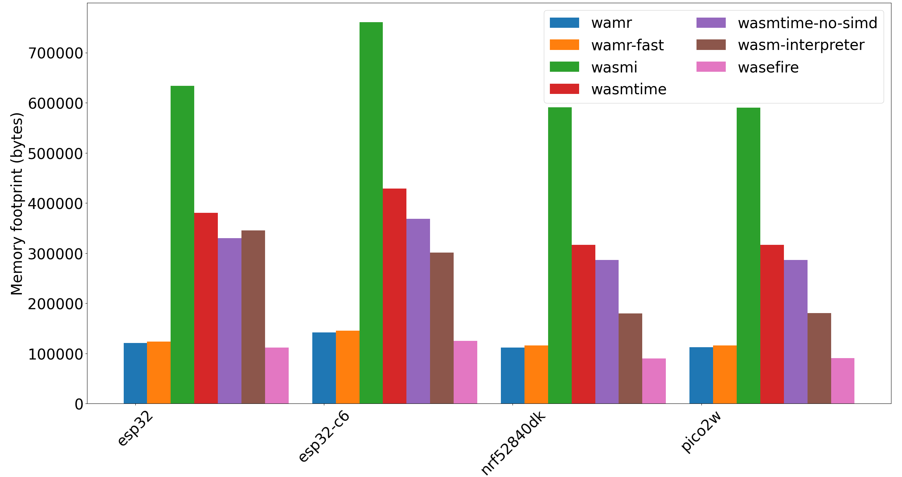
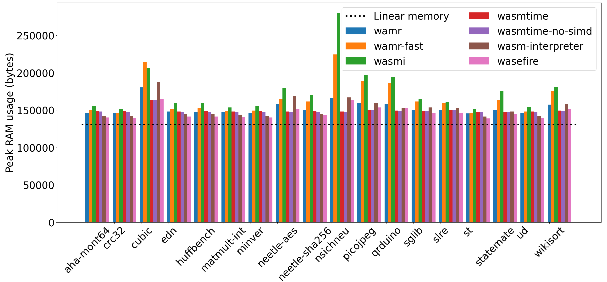
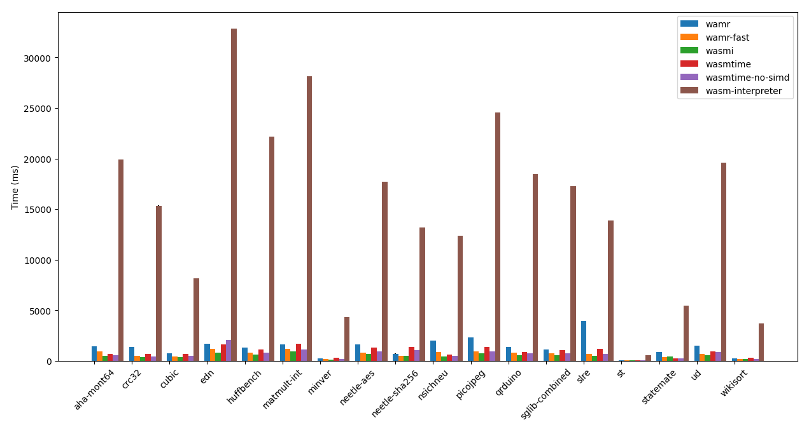
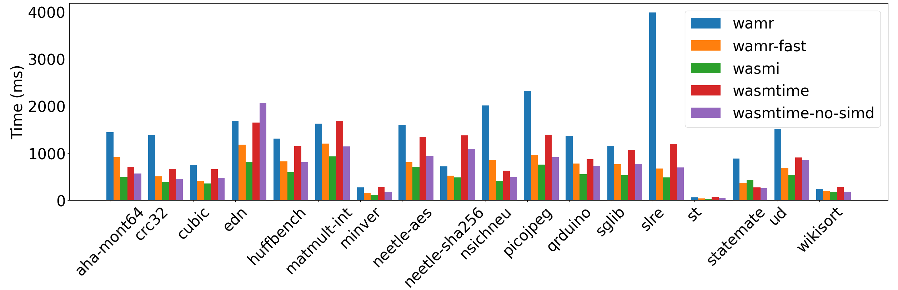
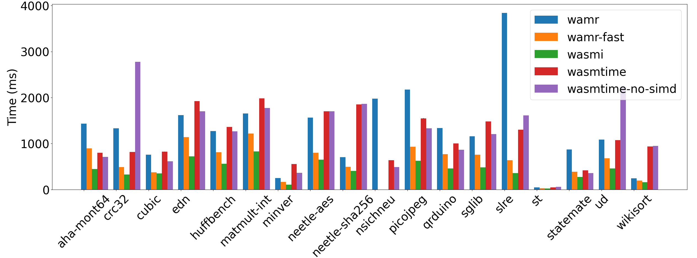
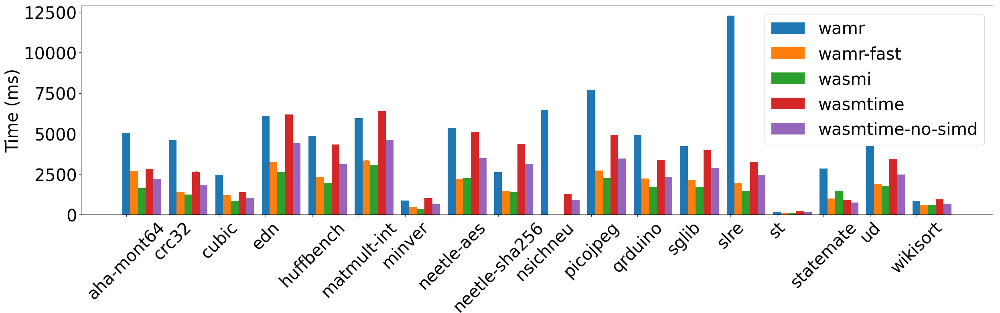
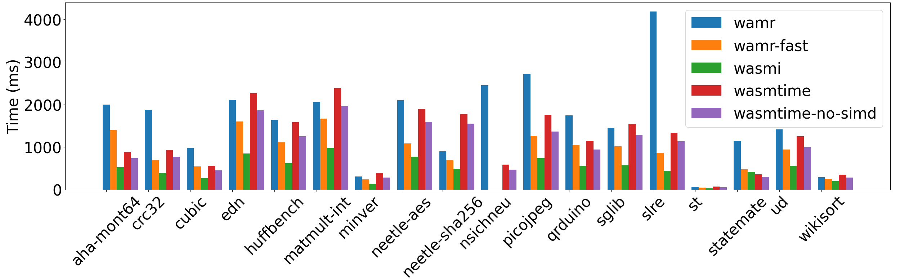

# Comparing WebAssembly Runtimes on top of a Rust Emebedded OS ([Ariel OS])

This repository aims to help in reproducibly benchmarking WebAssembly runtimes in the context of Ariel OS both in terms of code size and performance. Please first get introduced with Ariel OS by [getting started](https://ariel-os.github.io/ariel-os/dev/docs/book/getting-started.html). This uses a local (and modified) version of Ariel OS so only [Installing the build prerequisite](https://ariel-os.github.io/ariel-os/dev/docs/book/getting-started.html#installing-the-build-prerequisites) is required. After cloning the repository and initializing the submodules with `git submodule update --init --recursive`.
Use `laze build -b nrf52840dk` before using the scripts to initialize the symlinks.

## Setup

### Runtimes tested

- [Wasmtime](github.com/bytecodealliance/wasmtime) with and without SIMD enabled in its interpreter Pulley
- [Wasmi](https://github.com/wasmi-labs/wasmi)
- [Wasm-interpreter](https://github.com/DLR-FT/wasm-interpreter)
- [WAMR](github.com/bytecodealliance/wasm-micro-runtime) with the regular and Fast Interpreters

### Hardware considered
Board Name / MCU / Architecture:

- Pico 2W / RP2350 / ARM THUMBV8
- nRF52840DK / nRF52840 / ARM THUMBV7
- DFRobot Firebeetle 2 / ESP32-C6 / RISCV 32
- ESP-WROOM-32 / ESP-WROOM-32 / Xtensa

### Benchmarks used

- [CoreMark 1.0] using its wasm port found [here](github.com/wasm3/wasm-coremark)
- The [Embench 1.0] suite compiled from C to Wasm by us using [emscripten].

## Comparing Flash size

### Protocol

Every runtimes will be evaluated using the CoreMark minimal port originally found [here](github.com/wasm3/wasm-coremark).

For wasmtime, since it doesn't support raw wasm bytecode in `#![no_std]` contexts, an extra step of precompilation is needed. The following configuration is used for that step

```rust
use wasmtime::{Config, Engine, OptLevel};

fn main() -> wasmtime::Result<()> {
    let mut config = Config::new();

    // Options that were found to reduce code size
    config.memory_init_cow(false);
    config.generate_address_map(false);
    config.table_lazy_init(false);
    config.cranelift_opt_level(OptLevel::Speed);

    // 0 means limiting ourselves to what the module asked
    // This needs to be set at pre-compile time to use it at runtime
    config.memory_reservation(0);

    // Disabling this allows runtime optimizations but means that the maximum memory
    // that the module can have is
    // S = min(initial_memory, memory_reservation) + memory_reserver_for_growth
    // since it can grow by reallocating.
    config.memory_may_move(false);

    // Explictly disabling the component model
    config.wasm_component_model(false);

    let engine = Engine::new(&config)?;

    let wasm = include_bytes!("/path/to/input.wasm");

    let precompiled = engine.precompile_module(wasm)?;

    std::fs::write("input.cwasm", &precompiled).unwrap();

    Ok(())
}
```

### Results

Raw results can be found for each archiecture under `results/<board-name>/static-size-coremark.txt`. Below is a graph compiling the results.



This graph was generated using a [python script](./scripts/plot_mem_size.py)

## Comparing RAM usage

### Protocol

Every runtime was evaluated on every piece of the [Embench 1.0] benchmarks. Their peak usage was measured and was added to the size of the `.data` and `.bss` sections the ELF. Only the Pico2W was used because it was the only board where every runtime was able to run every benchmark snippet.

### Results

Raw results can be found under `results/pico2w/peakRAM-<runtime>.txt`. Below is a graph compiling the results.



This graph was generated using a [python script](./scripts/plot_ram_usage.py). The black dotted line corresponds the linear memory asked by the wasm modules.

## Comparing Performance

### Protocol

We measured the performance of runtimes using the two benchmarks [CoreMark 1.0] and [Embench 1.0]. We automated this task using [rust script](./scripts/run_benchmarks.rs). It requires a nightly rust compiler

```sh
$ ./scripts/run_benchmarks.rs --help
    Finished `dev` profile [unoptimized + debuginfo] target(s) in 0.09s
     Running `/home/tribe11200675/.cargo/build/69/ed28a36e155c3a/target/debug/run_benchmarks --help`
Helper script to run benchmarks and report the results

Usage: run_benchmarks.rs [OPTIONS] --benchmark <BENCHMARK> --output-file <OUTPUT_FILE> --board <BOARD> --runtime <RUNTIME>

Options:
  -b, --benchmark <BENCHMARK>      Type of benchmark to use [possible values: embench-1, embench-2, coremark]
  -o, --output-file <OUTPUT_FILE>  Output file of the benchmark results. If it exists, results will be appended to it
      --board <BOARD>              Board to run the benchmarks on
  -r, --runtime <RUNTIME>          Runtime to evaluate defaults to wasmtime [possible values: wasmtime, wasmtime-no-simd, wasmi, wasm-interpreter, wasefire, wasefire-pulley, wamr-fast, wamr-aot, wamr]
  -p, --probe <PROBE>              Probe ID used by probe-rs to disambiguate in presence of several devices
      --arch <ARCH>                Provide the arch string required for wamr [possible values: thumbv7, thumbv8, xtensa, riscv32]
      --monitor-heap               Monitor the Dynamic Memory usage
  -h, --help                       Print help
  -V, --version                    Print version
```

### Results

#### [CoreMark 1.0]

|                  | RP2350 | ESP-WROOM-32 | nRF52840 | ESP32-C6 |
|------------------|--------|--------------|----------|----------|
| WAMR             | 6.6    | 6.7          | 1.8      | 5.3      |
| WAMR Fast        | 10.8   | 11.0         | 3.8      |8.0       |
| Wasmi            | 15.5   | 17.3         | 4.8      | 14.5     |
| Wasmtime         | 13.2   | 11.6         | 3.5      | 9.9      |
| Wasmtime No SIMD | 18.6   | 11.7         | 5.1      | 12.3     |
| Wasm Interpreter | 0.6    | 0.5          | 0.2      | 0.6      |


#### [Embench 1.0]

Raw results can be found [here](./results-data). The figures shown below were made using a [python script](./scripts/plot_results.py). Only the absolute execution times are shown as they are proportional with the Embench scores.

##### RP2350






#### ESP-WROOM-32



#### nRF52840



#### ESP32-C6




## Appendix and additional information

The [emscripten] version used was `emscripten: 4.0.20 (6913738ec5371a88c4af5a80db0ab42bad3de681)`.
For the [Embench 1.0] snippets, we had to manually set the number of memory pages used to 2 because 1 wasn't enough in some cases. We achieved that by translating from Wasm to Wat, modify the Wat directly and then translate Wat back to Wasm. This was done using [`wasm-tools`] whose version was `wasm-tools: 1.239.0 (a64ae8dd0 2025-09-20)`.

The Wasm version of the benchmarks we used is available in the [benchmarks](./benchmarks/) directory. We believe that the Wasm Port of [Embench 1.0] that we produced is the only one readily available.

The script for running the benchmarks works well for every runtime expect WAMR. For Wamr, specifically on the ESP32-C6, a proper compiler need to be explicitly passed through the `TARGET_CC` environment variable. The compiler we recommaend is the one from ESP IDF. Below are instructions to do just that
```sh
git clone -b v5.5.2 --recursive https://github.com/espressif/esp-idf.git
cd ~/esp-idf
./install.sh esp32c6
```


Then, after `source`-ing `path/to/esp-idf/export.sh`, using `TARGET_CC=riscv32-esp-elf-gcc` should work.


[Wasmi]: https://github.com/wasmi-labs/wasmi
[Wasmtime]: https://github.com/bytecodealliance/wasmtime
[Wasm-interpreter]: https://github.com/DLR-FT/wasm-interpreter
[CoreMark 1.0]: https://www.eembc.org/coremark/
[Embench 1.0]: https://github.com/embench/embench-iot/tree/embench-1.0
[emscripten]: https://github.com/emscripten-core/emscripten
[`wasm-tools`]: https://github.com/bytecodealliance/wasm-tools
[Wasefire]: https://github.com/google/wasefire
[Ariel OS]: https://github.com/ariel-os/ariel-os